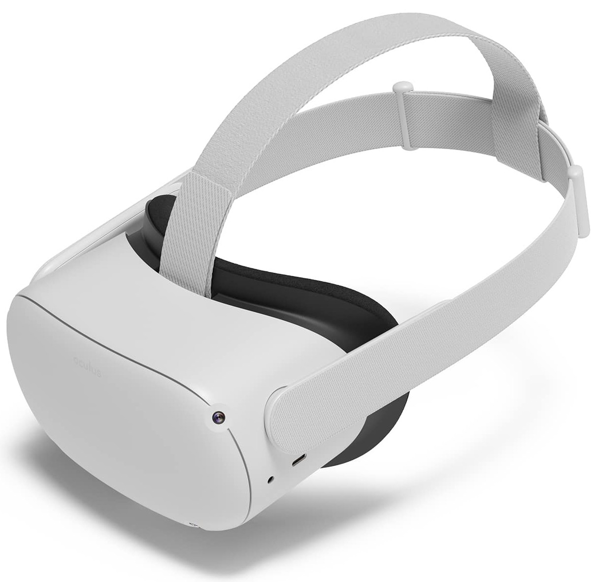
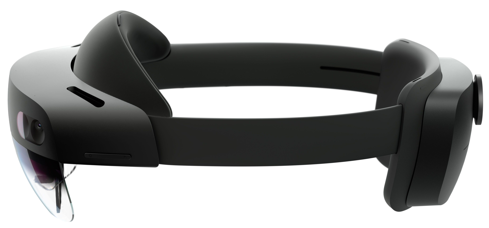

# Virtual and Augmented Reality

2022-04-18

I've been interested in virtual reality (VR) and augmented reality (AR) recently as the use case for the system(s) I'm working on in my MPhil project.
This blog post will cover my development experience in porting my [cubes](../cubes/) game to both VR and AR, and give a small demo for the latter.

Microsoft Windows was used for ease of development with [Unity](https://unity.com/) and as it's a hard requirement for the AR headset made by Microsoft.

## VR

{width=50%}

The [Oculus Quest 2](https://www.oculus.com/quest-2/) from Meta (formally Facebook) is a VR headset running an Android derivative.
This means you can do cool stuff like run [Termux](https://www.reddit.com/r/cyberDeck/comments/fc5sfr/oculus_quest_termux_selfcontained_hmd_cyberdeck/) on it (an Android terminal emulator and unvirtualised Linux environment).
It's nowhere near as flexible as something like what [SimulaVR](https://simulavr.com/) are doing, which features a neat [Haskell Wayland compositor](https://github.com/SimulaVR/Simula).

With access to the Oculus Quest 2, I was first able to explore the world of free games on the [Oculus store](https://www.oculus.com/experiences/quest/).

I quickly found it outlived its novelty, however, and as I've always enjoyed making things more than using them I moved on to try and develop something for the headset. Instead of creating something brand new, I decided to try and port my existing cubes game created back at the end of my final undergrad year.

Development for the Quest is quite a polished experience, although I may only be saying this in hindsight after developing for the Hololens.
Bar some linkrot, the [documentation](https://developer.oculus.com/documentation/unity/unity-gs-overview/) covers setting up a development environment and creating an app.
The basic gist is to install Unity with some Android and [VR support](https://docs.unity3d.com/Manual/XRPluginArchitecture.html) plugins.
You also need either developer mode to sideload apps, a compatible USB-C cable, or [Oculus Air Link](https://support.oculus.com/airlink/) with WiFi that plays nice.
I opted for the latter.
With some modifications to the [scene camera](https://github.com/RyanGibb/cubes/compare/vr#diff-4fa152eddce941e5e1dba548d9551e10a7055f8cc4ceabf8085efce55054a12eL149) and the [movement script](https://github.com/RyanGibb/cubes/compare/vr#diff-6559439996a27afac6044cabe35d54d1d69bed7fc62874eb3d86bfaf3370d1a3R1) it was good to go.

UX for VR is a whole different ball game - but it didn't give nearly as much nausea as it might have.

Many thanks to [Paul Johnson](https://pjohnsonportfolio.wordpress.com/) for lending me this device.

See the source code [here](https://github.com/RyanGibb/cubes/tree/vr).

## AR

{width=50%}

The [Microsoft Hololens 2](https://www.microsoft.com/en-us/hololens/) from Microsoft is an AR headset running the "Windows Holographic" OS - essentially a 64bit ARM version of windows with a spatial window manager.
This was a real pain as it turns out it doesn't support Win32 applications - which killed my [dreams](../ar_terminal) of running the [Windows Terminal](https://github.com/microsoft/terminal) on it.
See [this](https://github.com/microsoft/terminal/issues/12219) GitHub issue for more info 

Aside from being hostile to hacking, the development experience was quite horrible.
Recalling from memory, the development environment setup steps were something like:

- Install Unity Hub
- Install Unity Editor through Unity Hub
- Install Windows 10 SDK 10.0.18362.0 or later
- Install Microsoft Mixed Reality Toolkit
	- Purportedly requires [.NET 5.0 runtime](https://dotnet.microsoft.com/en-us/download/dotnet/5.0), but actuality requires [.NET Desktop Runtime 5.0](https://dotnet.microsoft.com/en-us/download/dotnet/thank-you/runtime-desktop-5.0.13-windows-x64-installer)
- Visual Studio requires a restart
- Install workloads:
    - 'Desktop development with C++'
    - 'Universal Windows Platform (UWP) development'
    - 'Game development with Unity'
    - C++ (v142) Universal Windows Platform tools (required when using Unity)
- Compile the Unity project to a Visual Studio project
- Change visual studio startup project to Cubes from Il2CppOutputProject
- And run on the Hololens from there (which also installs the App)

Having started to [use](https://github.com/RyanGibb/nixos/) the [nix](https://nixos.org/) package manager recently this is exactly the dependency and reproducibility headache I'm trying to avoid.

To its credit, the Visual Studio remote machine execution over the local network worked very well once it was set up.
The [device portal API](https://docs.microsoft.com/en-us/windows/mixed-reality/develop/advanced-concepts/device-portal-api-reference) also proved very useful in watching a real-time feed of the user's POV.

This [article](https://docs.microsoft.com/en-us/learn/modules/learn-mrtk-tutorials/) proved the most useful in setting up the development environment.
Navigating the Microsoft documentation proved challenging in itself.

The modifications to the project were more significant than for the Quest 2 but mainly boiled down to getting things working the way the Microsoft Mixed Reality Toolkit (MRTK) wanted.

Many thanks to [Anil Madhavapeddy](https://anil.recoil.org/) for lending me this device.

See the source code [here](https://github.com/RyanGibb/cubes/tree/ar).

## Demo

See a demo of this game on the Hololens 2 with some willing participants below.

<iframe src="https://www.youtube-nocookie.com/embed/CLPvYf_EE6k" title="YouTube video player" frameborder="0" allow="accelerometer; autoplay; clipboard-write; encrypted-media; gyroscope; picture-in-picture" allowfullscreen style="display: block; margin: 0 auto;"></iframe>
