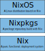

# Hillingar: building Mirage unikernels with Nix

2022-10-10

> An arctic mirage[@lehnNovayaZemlyaEffect1979]

 and [GIMP](https://www.gimp.org/)] ](./hillingar2-caml.png){width=70% min-width=5cm}

## Introduction

As part of my master's thesis, I've been hosting an authoritative DNS server at `ns1.gibbr.org`.
More can be read in the dissertation[@gibbSpatialNameSystem2022], but DNS is one of the fundamental building blocks of the modern Internet.
And as part of my master's thesis procrastination, I've been running it on a NixOS machine.
Using NixOS, deploying a DNS server is as simple as:
```nix
{
  services.bind = {
    enable = true;
    zones."gibbr.org" = {
      master = true;
      file = "gibbr.org.zone";
    };
  };
}
```

Which we can then query with
```bash
$ dig gibbr.org @ns1.gibbr.org +short
45.77.205.198
```

Setting up a glue record with our registrar pointing `ns1.gibbr.org` to the IP address of our DNS-hosting machine allows anyone to use our authoritative server via their resolver.

As you might notice, this is running the venerable bind^[[ISC bind](https://www.isc.org/bind/) has many [CVE's](https://www.cvedetails.com/product/144/ISC-Bind.html?vendor_id=64)] written in C.
As an alternative, using functional high-level type-safe programming languages to create network applications can greatly benefit safety and usability whilst maintaining performant execution[@madhavapeddyMelangeCreatingFunctional2007].
One such language is OCaml.

The MirageOS project is a deployment method for these OCaml programs[@madhavapeddyUnikernelsLibraryOperating2013].
Instead of running them as a traditional Unix process, we instead create a specialised 'unikernel' operating system to run the application, which allows dead code elimination improving security with smaller attack surfaces and improved efficiency.

However, to deploy a Mirage unikernel with NixOS one has to use the imperative deployment methodologies native to the OCaml ecosystem, eliminating the benefit of reproducible systems that Nix gives us.
This blog post will explore how we enabled reproducible deployments of Mirage unikernels with Nix.

## Nix

![ Nix snowflake^[As 'nix' means snow in Latin. Credits to Tim Cuthbertson.] ](./nix-snowflake.svg){width=60% min-width=5cm}

At this point, the curious reader might be wondering, what on earth is 'Nix'?

Nix is a deployment system that uses cryptographic hashes to compute unique paths for components^[NB: we will use component, dependency, and package somewhat interchangeably in this blog post as they all fundamentally mean the same thing - a piece of software.] which are stored in a read-only directory, the Nix store, at `/nix/store/<hash>-<name>`.
<!-- We replace references to a component with this absolute path, or symlink into the nix store for the system path, for example. -->
This provides a number of benefits including concurrent installation of multiple versions of a package, atomic upgrades and downgrades, and 
multiple user environments[@dolstraNixSafePolicyFree2004].

Nix uses a declarative domain-specific language (DSL), also called 'Nix', to build and configure software.
The snippet used to deploy the DNS server is in fact a Nix expression.
This example doesn't demonstrate it but Nix is Turing complete, being inspired by Haskell. 
Nix does not, however, have a type system.

We used the DSL to write derivations for software, which describes how to build said software with input components and a build script.
This Nix expression is then 'instantiated' to create 'store derivations' (`.drv` files), which is the low-level representation of how to build a single component.
This store derivation is 'realised' into a built artefact, hereafter referred to as 'building'.

Possibly the simplest Nix derivation uses bash to create a single file containing `Hello, World!`:
```nix
{ pkgs ? import <nixpkgs> {  } }:

builtins.derivation {
  name = "hello";
  system = builtins.currentSystem;
  builder = "${nixpkgs.bash}/bin/bash";
  args = [ "-c" ''echo "Hello, World!" > $out'' ];
}
```
Note that `derivation` is a function that we're calling with one argument which is a set of attributes.

We can instantiate this Nix derivation expression to create a store derivation:
```
$ nix-instantiate default.nix
/nix/store/5d4il3h1q4cw08l6fnk4j04a19dsv71k-hello.drv
$ nix show-derivation /nix/store/5d4il3h1q4cw08l6fnk4j04a19dsv71k-hello.drv
{
  "/nix/store/5d4il3h1q4cw08l6fnk4j04a19dsv71k-hello.drv": {
    "outputs": {
      "out": {
        "path": "/nix/store/4v1dx6qaamakjy5jzii6lcmfiks57mhl-hello"
      }
    },
    "inputSrcs": [],
    "inputDrvs": {
      "/nix/store/mnyhjzyk43raa3f44pn77aif738prd2m-bash-5.1-p16.drv": [
        "out"
      ]
    },
    "system": "x86_64-linux",
    "builder": "/nix/store/2r9n7fz1rxq088j6mi5s7izxdria6d5f-bash-5.1-p16/bin/bash",
    "args": [ "-c", "echo \"Hello, World!\" > $out" ],
    "env": {
      "builder": "/nix/store/2r9n7fz1rxq088j6mi5s7izxdria6d5f-bash-5.1-p16/bin/bash",
      "name": "hello",
      "out": "/nix/store/4v1dx6qaamakjy5jzii6lcmfiks57mhl-hello",
      "system": "x86_64-linux"
    }
  }
}
```

And build the store derivation:
```sh
$ nix-store --realise /nix/store/5d4il3h1q4cw08l6fnk4j04a19dsv71k-hello.drv
/nix/store/4v1dx6qaamakjy5jzii6lcmfiks57mhl-hello
$ cat /nix/store/4v1dx6qaamakjy5jzii6lcmfiks57mhl-hello
Hello, World!
```

Most nix tooling does these two steps together:
```
nix-build default.nix
this derivation will be built:
  /nix/store/q5hg3vqby8a9c8pchhjal3la9n7g1m0z-hello.drv
building '/nix/store/q5hg3vqby8a9c8pchhjal3la9n7g1m0z-hello.drv'...
/nix/store/zyrki2hd49am36jwcyjh3xvxvn5j5wml-hello
```

Nix realisations (hereafter referred to as builds) are done in isolation to ensure reproducibility.
Projects often rely on interacting with package managers to make sure all dependencies are available, and may implicitly rely on system configuration at build time.
To prevent this, every Nix derivation is built in isolation, without network access or access to the global file system, with only other Nix derivations as inputs.

> The name Nix is derived from the Dutch word niks, meaning nothing; build actions do not see anything that has not been explicitly declared as an input[@dolstraNixSafePolicyFree2004].

<!-- There are analogies to functional program versus imperative programming, but applied to system management and software builds/deployment. -->

#### Nixpkgs

You may have noticed a reference to `nixpkgs` in the above derivation.
As every input to a Nix derivation also has to be a Nix derivation, one can imagine the tedium involved in creating a Nix derivation for every dependency of your project.
However, Nixpkgs^[ [github.com/nixos/nixpkgs](https://github.com/nixos/nixpkgs) ] is a large repository of software packaged in Nix, where a package is a Nix derivation.
We can use packages from Nixpkgs as inputs to a Nix derivation, as we've done with `bash`.

There is also a command line package manager installing packages from Nixpkgs, which is why people often refer to Nix as a package manager.
While Nix, and Therefore nix package management, is primarily source-based -- since derivations describe how to build software from source -- binary deployment is an optimization of this.
Since packages are built in isolation and entirely determined by their inputs, binaries can be transparently deployed by downloading them from a remote server instead of building the derivation locally.

#### NixOS

NixOS^[[nixos.org](https://nixos.org)] is a Linux distribution built with Nix from a modular, purely functional specification[@dolstraNixOSPurelyFunctional2008].
It has no traditional filesystem hierarchy (FSH) -- like `/bin`, `/lib`, `/usr` -- but instead stores all components in `/nix/store`.
The configuration of the system is managed by Nix, with configuration files being built from modular Nix expressions.
NixOS modules are just that -- small bits of configuration written in Nix that can be composed to build a full NixOS system^[[NixOS manual Chapter 66. Writing NixOS Modules](https://nixos.org/manual/nixos/stable/index.html#sec-writing-modules).]
While many NixOS modules are provided in the Nixpkgs repository they can also be written by a user.
For example, the expression used to deploy a DNS server is a NixOS module.
The system is built from this configuration like a Nix derivation is built.

NixOS minimises global mutable state that -- without knowing it -- you might rely on being set up in a certain way.
For example, you might follow some instructions to run a series of shell commands and edit some files in a certain way to get a piece of software working, but then forgot and fail to document the process.
Nix forces you to encode this in a reproducible way, which is extremely useful for replicating software configurations and deployments, aiming to solve the 'It works on my machine' problem.
Docker is often used to fix this configuration problem, but nix aims to be more reproducible (restricting network access).
This can be frustrating at times because it can make it harder to get off the ground with a project, but I've found the benefits outway the cons for me.

My own NixOS configuration is publicly available^[ [github.com/RyanGibb/nixos](https://github.com/RyanGibb/nixos) ].
This makes it trivial to reproduce my system -- a collection of various configurations, services, and hacks -- on another machine.
I use it to manage servers, workstations, and more.
Compared to my previous approach of maintaining a git repository of dotfiles, this is much more modular, reproducible, and flexible.
And if you want to deploy some new piece of software or service, it can be as easy as changing a single line in your system configuration.

Despite these advantages, the reason I switched to NixOS from Arch Linux was simpler; NixOS allows rollbacks and atomic upgrades.
As Arch packages bleeding-edge software with rolling updates it would frequently happen that some new version of something I was using would break.
Arch has one global coherent package set, so to avoid complications with solving dependency versions Arch doesn't support partial upgrades.
So the options were to wait for the bug to be fixed, or manually rollback all the updated packages by inspecting the pacman log (the Arch package manager) and reinstalling the old versions from the local cache.
While there may be tools on top of `pacman` to improve this, the straw that broke the caml's back was when my machine crashed while updating the Linux kernel and I had to reinstall it from a live USB.

While Nixpkgs also has one global coherent package set, one can use multiple instances of Nixpkgs (i.e. channels) at once to support partial upgrades, as the Nix store allows multiple versions of a dependency to be stored.
This also supports atomic upgrades as all the old versions of software can be kept until garbage collected.
The pointers to the new packages are only updated when the install succeeds, so the crash during the Linux kernel upgrade would not have broken my OS install on NixOS.
And every new system configuration creates a GRUB entry, so you can boot previous systems even from your UEFI/BIOS.

To summarise the parts of the Nix ecosystem that we've discussed:

{width=50% min-width=5cm}

#### Flakes

We also use Nix flakes for this project.
Without going into too much depth, for our purposes, they enable hermetic evaluation of nix expressions and provide a standard way to compose Nix projects.
With flakes, instead of using a Nixpkgs repository version from a 'channel'^[[nixos.org/manual/nix/stable/package-management/channels.html](https://nixos.org/manual/nix/stable/package-management/channels.html)], we pin Nixpkgs as an input to every Nix flake -- be it a project build with Nix or a NixOS system.
<!-- One of the reasons for improving Nix project composing is that there's some discussion around the sustainability of the Nixpkgs monorepo workflow^[https://discourse.nixos.org/t/nixpkgss-current-development-workflow-is-not-sustainable/18741](https://discourse.nixos.org/t/nixpkgss-current-development-workflow-is-not-sustainable/18741]. -->
Integrated with flakes there is also a new `nix` command aimed at improving the UI of Nix.
More detail about flakes can be read in a series of blog posts by Eelco on the topic^[[tweag.io/blog/2020-05-25-flakes](https://www.tweag.io/blog/2020-05-25-flakes/)].

## MirageOS

![ ^[Credits to Takayuki Imada] ](./mirage-logo.svg){width=50% min-width=5cm}

MirageOS is a library operating system that creates unikernels containing low-level operating system code and high-level application code bundled into one kernel and one address space[@madhavapeddyUnikernelsLibraryOperating2013].
<!-- security, performance, speed -->
It was the first such 'unikernel creation framework', but it comes from a long lineage of OS research such as the exokernel library OS architecture[@englerExokernelOperatingSystem].
Embedding application code in the kernel allows for dead-code elimination -- removing OS interfaces that are used -- reducing the unikernels attack surface and offering improved efficiency.

![ Contrasting software layers in existing VM appliances vs. unikernel's standalone kernel compilation approach[@madhavapeddyUnikernelsLibraryOperating2013] ](./mirage-diagram.svg){width=70% min-width=5cm}

Mirage unikernels are written in the typesafe high-level functional programming language OCaml.
OCaml is a bit more practical than other functional programming languages such as Haskell for systems programming, such as supporting falling back on impure imperative code or mutable variables when warranted.

## Deploying Unikernels

Now that we understand what Nix and Mirage are, and we've motivated the desire to deploy Mirage unikernels on a NixOS machine, what's stopping us from doing just that?
Well, to support deploying a mirage unikernel, such as for a DNS server, we would need to write a NixOS module for it.

A paired-down^[The full module can be found [here](https://github.com/NixOS/nixpkgs/blob/fe76645aaf2fac3baaa2813fd0089930689c53b5/nixos/modules/services/networking/bind.nix)] version of the bind NixOS module, the module we use in our Nix expression for deploying a DNS server on NixOS ([&#167;](#cb1)), is:
```nix
{ config, lib, pkgs, ... }:

with lib;

{
  options = {
    services.bind = {
      enable = mkEnableOption "BIND domain name server";
      
      zones = mkOption {
        ...
      };
    };
  };

  config = mkIf cfg.enable {
    systemd.services.bind = {
      description = "BIND Domain Name Server";
      after = [ "network.target" ];
      wantedBy = [ "multi-user.target" ];

      serviceConfig = {
        ExecStart = "${pkgs.bind.out}/sbin/named";
      };
    };
  };
}
```

Notice the reference to `pkgs.bind`.
This is the Nixpkgs repository Nix derivation for the `bind` package.
Recall that every input to a Nix derivation is itself a Nix derivation ([&#167;](#nixpkgs)); in order to use a package in a Nix expression -- i.e. a NixOS module -- we need to build said package with Nix.
Once we build a Mirage unikernel with Nix, we can write a NixOS module to deploy it.

## Building Unikernels

Mirage uses the package manager for OCaml Opam^[[opam.ocaml.org](https://opam.ocaml.org/)].
Dependencies in Opam, as is common in programming language package managers, has a file which -- among other meta-data, build/install scripts -- specifies dependencies and their version constraints.
For example^[For [mirage-www](https://github.com/mirage/mirage-www) targetting `hvt`.]
```
...
depends: [
  "arp" { ?monorepo & >= "3.0.0" & < "4.0.0" }
  "ethernet" { ?monorepo & >= "3.0.0" & < "4.0.0" }
  "lwt" { ?monorepo }
  "mirage" { build & >= "4.2.0" & < "4.3.0" }
  "mirage-bootvar-solo5" { ?monorepo & >= "0.6.0" & < "0.7.0" }
  "mirage-clock-solo5" { ?monorepo & >= "4.2.0" & < "5.0.0" }
  "mirage-crypto-rng-mirage" { ?monorepo & >= "0.8.0" & < "0.11.0" }
  "mirage-logs" { ?monorepo & >= "1.2.0" & < "2.0.0" }
  "mirage-net-solo5" { ?monorepo & >= "0.8.0" & < "0.9.0" }
  "mirage-random" { ?monorepo & >= "3.0.0" & < "4.0.0" }
  "mirage-runtime" { ?monorepo & >= "4.2.0" & < "4.3.0" }
  "mirage-solo5" { ?monorepo & >= "0.9.0" & < "0.10.0" }
  "mirage-time" { ?monorepo }
  "mirageio" { ?monorepo }
  "ocaml" { build & >= "4.08.0" }
  "ocaml-solo5" { build & >= "0.8.1" & < "0.9.0" }
  "opam-monorepo" { build & >= "0.3.2" }
  "tcpip" { ?monorepo & >= "7.0.0" & < "8.0.0" }
  "yaml" { ?monorepo & build }
]
...
```

And each of these dependencies will have its own dependencies with their own version constraints.
As we can only link one dependency into the resulting program, we need to solve a set of dependency versions that satisfies these constraints.
This is not an easy problem.
In fact, it's NP-complete^[[research.swtch.com/version-sat](https://research.swtch.com/version-sat)].
Opam uses the Zero Install`^[[0install.net](https://0install.net)] SAT solver for dependency resolution.

Nixpkgs has a large number of OCaml packages^[[github.com/NixOS/nixpkgs pkgs/development/ocaml-modules](https://github.com/NixOS/nixpkgs/blob/9234f5a17e1a7820b5e91ecd4ff0de449e293383/pkgs/development/ocaml-modules/)] which we could provide as build inputs to a Nix derivation.
But they are not as complete nor up to date as those in `opam-repository`^[[github.com/ocaml/opam-repository](https://github.com/ocaml/opam-repository)].
A larger issue, however, is that Nixpkgs has one global coherent set of package versions^[Bar some exceptional packages that have multiple major versions packaged, like Postgres.] ^[In fact Arch has the same approach, which is why it doesn't support partial upgrades ([&#167;](#nixos)).].
The support for installing multiple versions of a package concurrently comes from the fact that they are stored at a unique path and can be referenced separately, or symlinked, where required.
So different projects or users that use a different version of Nixpkgs won't conflict, but Nix does not do any dependency version resolution -- everything is pinned.
This has led to much confusion^[[github.com/NixOS/nixpkgs/issues/9682](https://github.com/NixOS/nixpkgs/issues/9682)] with how to install a specific version of a package.

Luckily there already exists a project from Tweag called `opam-nix` to deal with this^[[github.com/tweag/opam-nix](https://github.com/tweag/opam-nix)] ^[Another project, [timbertson/opam2nix](https://github.com/timbertson/opam2nix), also exists, but depends on a binary of itself at build time as it's written in OCaml as opposed to Nix, is not as minimal (higher LOC count), and isn't under active development (with development focused on [github.com/timbertson/fetlock](https://github.com/timbertson/fetlock))].
This project uses the Opam dependency versions solver inside a Nix derivation, and then something called Import From Derivation (IFD)^[[nixos.wiki/wiki/Import_From_Derivation](https://nixos.wiki/wiki/Import_From_Derivation)] to create derivations from the resulting dependency versions.
Materialization can be used to create a kind of lockfile for this resolution which can be committed to the project to avoid having to do IFD on every new build.
An alternative may be to use Opam's in-built version pinning^[[github.com/RyanGibb/hillingar/issues/4](https://github.com/RyanGibb/hillingar/issues/4)].

This still doesn't support building our Mirage unikernels, though.
Unikernels quite often need to be cross-compiled: compiled to run on a platform other than the one they're being built on.
A common target, Solo5^[[github.com/Solo5/solo5](https://github.com/Solo5/solo5)], is a sandboxed execution environment -- essentially acting as a minimal shim layer to interface between unikernels and different hypervisor backends.
Solo5 uses a different `glibc` which requires cross-compilation.
Mirage 4^[[mirage.io/blog/announcing-mirage-40](https://mirage.io/blog/announcing-mirage-40)] uses the Dune build system^[[dune.build](https://dune.build)] which supports cross-compilation through toolchains; a host compiler is installed in an Opam switch (a virtual environment) as normal, and a target compiler^[[github.com/mirage/ocaml-solo5](https://github.com/mirage/ocaml-solo5)] is created by modifying the host compiler.
But the cross-compilation context of packages is only known at build time, as some metaprogramming modules may require preprocessing with the host compiler^[e.g. in [`mirage-tcpip`](https://github.com/mirage/mirage-tcpip/blob/3ab30ab7b43dede75abf7b37838e051e0ddbb23a/src/tcp/dune#L9-L10).].
To ensure that the right compilation context is used, this means we have to provide Dune the sources of all our dependancies.
A tool called `opam-monorepo` was created to do just that.

> Cross-compilation - the details of how to build some native code can come late in the pipeline, which isn't a problem if the sources are available^[[github.com/tarides/opam-monorepo](https://github.com/tarides/opam-monorepo/blob/feeb325c9c8d560c6b92cbde62b6a9c5f20ed032/doc/faq.mld#L42)].

We extended the `opam-nix` project to support the `opam-monorepo` workflow with this pull request: [github.com/tweag/opam-nix/pull/18](https://github.com/tweag/opam-nix/pull/18).

This is very low-level support for building Mirage unikernels with Nix, however.
In order to provide a better user experience, we also created the Hillinar Nix flake: [github.com/RyanGibb/hillingar](https://github.com/ryanGibb/hillingar).
This wraps the mirage tooling and `opam-nix` function calls so that a simple high-level flake can be dropped into a Mirage project to support building it with Nix.
To add Nix build support to a unikernel, simply:
```bash
# create a flake from hillingar's default template
$ nix flake new . -t github:/RyanGibb/hillingar
# substitute the name of the unikernel you're building
$ sed -i 's/throw "Put the unikernel name here"/"<unikernel-name>"/g' flake.nix
# build the unikernel with Nix for a particular target
$ nix build .#<target>
```

For example, see the flake for building the Mirage website as a unikernel with Nix: [github.com/RyanGibb/mirage-www/blob/master/flake.nix](https://github.com/RyanGibb/mirage-www/blob/master/flake.nix).

## Dependency Management

To step back for a moment and look at the big picture, we can consider three different types of dependacies at play here:

1. System dependancies:<br>
Are dependancies installed through the system package manager -- `depexts` in Opam parlance.
This is Nix for Hillinar, but another platform's package managers include `apt`, `pacman`, and `brew`.
For unikernels these are often C libraries like `gmp`.
2. Library dependancies:<br>
Are installed through the programming language package manager.
This is `opam` here, but other language package managers include `pip`, `node`, and `cargo`.
These are the dependancies that often have version constraints and require complicated resolution possibly using a SAT solver.
3. Project dependancies:<br>
Are dependencies between files, modules, classes, or another unit of code, inside one project, often a version control system repository.
E.g. C includes, Java classes, Python imports, and OCaml modules.

Nix deals well with system dependencies but doesn't have a native way of resolving library dependency versions.
Opam deals well with library dependencies but doesn't have a consistent way of installing system packages in a reproducible way.
And Dune deals well with project dependencies, but not the others (although this may be changing in the future).

#### Cross-compilation 
(library -> project)
// opam cross compilation context

Dune is used to support cross-compilation for Mirage unikernels.
This means we're essentially encoding the 

problem that it's by module
so what if dune takes on more of opam's


Opam has no concept to cross compilation
So the cross compilation information is included in the build system instructions like pre-processed this particular module in the host compiler, as oppsed to the target compiler.
Which is something Dune has - a tool chin which has a target compiler embedded in it, which is modified from the host compiler.
That's a bit tricky because it means we need to get all of the sources for the dependencies because we don't know in advance what context they're going to need to be built in?

dune cross compition ---...

I think it could be interesting to try and encode this in the package manager.
Like this this particular module will be will built for the host compiler or the target compiler.
But the tricky thing is some dependencies have modules which will be built in the host compiler, and some in the target compiler.
We're conflating the library and project deps here, because we need the cross compilation context in the package manager, but the package manager only has a concept of packages - and not modules - inside a project or dependancy.
You can have multiple packages inside of development repository, and then multiple modules inside one package.
It's kind of messy - there's no one cohesive vision.


- we can benefit from nix cross compilation support (?

The build process of certain compilers is written in such a way that the compiler resulting from a single build can itself only produce binaries for a single platform. The task of specifying this single “target platform” is thus pushed to build time of the compiler. The root cause of this is that the compiler (which will be run on the host) and the standard library/runtime (which will be run on the target) are built by a single build process. 


#### Version Resolution
(system -> library)
// system + library
use opam version rsolution

The workaround to get


Going forward, is there a way to manage 3 dep versions in a more unified way?
work in:
https://github.com/nix-community/dream2nix
but focusing on code dedduplication

https://github.com/timbertson/fetlock


could do version solving in nix:
I would be very intersted in a version constrained solver that can be used in a Nix derivation.
This would require some ecosystem-logic specific logic to obtain the dependancy versions, and to create derivations for the resulting sources, but otherwise should be ecosystem agnostic

lockfile:
https://github.com/RyanGibb/opam-nix#materialization

However this doesn't address project dependancies...


(library)
// sat solver even required?

https://research.swtch.com/version-sat

trying to link a binary....

It could be interesting to link a binary using different versions of the same package (preprending signatures with versions, say).

> Another way to avoid NP-completeness is to attack assumption 4: what if two different versions of a package could be installed simultaneously? Then almost any search algorithm will find a combination of packages to build the program; it just might not be the smallest possible combination (that's still NP-complete). If B needs D 1.5 and C needs D 2.2, the build can include both packages in the final binary, treating them as distinct packages. I mentioned above that there can't be two definitions of printf built into a C program, but languages with explicit module systems should have no problem including separate copies of D (under different fully-qualified names) into a program. 

Lucas has a vision of resolving dependencies by interface types rather than numerical versions...


#### Build systems
(system -> project)
// Nix low level build system

The build script in a Nix derivation, if it doesn't invoke a compiler directly, often invokes a build system like `make`.
But Nix can also be considered a build system too[@mokhovBuildSystemsCarte2018].
It takes a build graph and computes.

If any of the detivtion's inputs change, the hash will change, and the path will change. So this.captures deep traces of inputs (as each input is also a deticaiton with a hash base on its inputs).

Nix can also be thought as a coarse grained build system 

and low level stuff?
[1]	E. Dolstra, The purely functional software deployment model. S.l.: s.n., 2006.
chapter 10

// Cross-compilation


## Conclusion

To summarise, this project was motivated ([&#167;](#introduction)) by deploying unikernels on NixOS ([&#167;](#deploying-unikernels)).
Towards this end, we added support for building Mirage unikernels with Nix;
we extended `opam-nix` to support the `opam-monorepo` workflow and created the Hillingar project to provide a usable Nix interface ([&#167;](#building-unikernels)).
This required scrutinizing the OCaml and Nix ecosystems along the way in order to marry them, and some thoughts on dependency management were developed in this context ([&#167;](#dependency-management)).
Many strange issues and edge cases were uncovered during this project, but now that we've encoded them in Nix hopefully others won't have to repeat the experience!

While only one was the primary motivation, other benefits of building unikernels with Nix have been revealed along the way:

- Reproducible and low-config Unikernel deployment using NixOS modules is enabled.
- Nix allows reproducible builds pinning system dependencies and composing multiple language environments. For example, the OCaml package `conf-gmp` is a 'virtual package' that relies on a system installation of the C/Assembly library `gmp` (The GNU Multiple Precision Arithmetic Library).
Nix easily allows us to depend on this package in a reproducible way.
- We can benefit from Nix cross-compilation support (to be explored).

There exists related work in the deployment and reproducible building of Mirage unikernels

relevant work:
https://mirage.io/blog/deploying-mirageos-robur
Nix is source based...
could deploy binaries with a binary cache
as long as, e.g. zonefile, is not part of the build

reproducible builds:
https://hannes.nqsb.io/Posts/ReproducibleOPAM
https://robur.coop/Projects/Reproducible_builds

work on deploying them:
https://hannes.robur.coop/Posts/VMM


There are still a lot of things to improve with this project, as detailed at [github.com/RyanGibb/hillingar/issues](https://github.com/RyanGibb/hillingar/issues).
But the primary limitations of the project are that complex integration is required with the OCaml ecosystem to solve dependency version constraints with `opam-nix` and cross-compilation requires cloning all sources locally with `opam-monorepo` ([&#167;](#dependency-management)).
Another issue that proved an annoyance during this project is the Nix DSL's dynamic typing.
When writing simple derivations this doesn't often prove an issue, but when writing complicated logic it quickly gets in the way of productivity; the runtime errors produced can be very hard to parse.
Thankfully there is work towards creating a typed language for the Nix deployment system, such as Nickel^[[www.tweag.io/blog/2020-10-22-nickel-open-sourcing](https://www.tweag.io/blog/2020-10-22-nickel-open-sourcing/)].
However gradual typing is hard, and Nickel still isn't ready for real-world use despite being open-sourced (in a week as of writing this) for 2 years.

To conclude, while NixOS and MirageOS take fundamentally very different approaches, they're both trying to bring some kind of functional programming paradigm to operating systems.
NixOS does this in a top-down manner, trying to tame Unix with functional principles like laziness and immutability^[[tweag.io/blog/2022-07-14-taming-unix-with-nix](https://www.tweag.io/blog/2022-07-14-taming-unix-with-nix/)].
Whereas MirageOS does this by throwing Unix out the window and rebuilding the world from scratch in a very much bottom-up approach.
Despite these two projects have such different motivations and goals, Hillingar aims to get the best from both worlds by marrying the two.

Finally, I want to thank some people for their help with this project:

- Lucas Pluvinage for invaluable help with the OCaml ecosystem.
- Alexander Bantyev for getting me up to speed with the `opam-nix` project and working with me on the `opam-monorepo` workflow integration.
- Anil Madhavapeddy for having a discussion that led to the idea for this project.
- Björg Bjarnadóttir for icelandic language consultation ('Hillingar').
- And finally, everyone at Tarides for being so welcoming and helpful!
<!-- A copy of this blog post can be found on Tarides website. -->

This work was completed with the support of [Tarides](https://tarides.com/).

---

If you spot any errors or have any questions, please get in touch at [ryan@gibbr.org](mailto:ryan@gibbr.org).

If you have a unikernel, consider trying to build it with Hillingar, and please report any problems to [github.com/RyanGibb/hillingar/issues](https://github.com/RyanGibb/hillingar/issues)!

---

#### References

<div id="refs"></div>

<div id="footnotes"></div>
