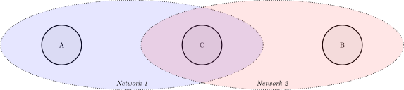
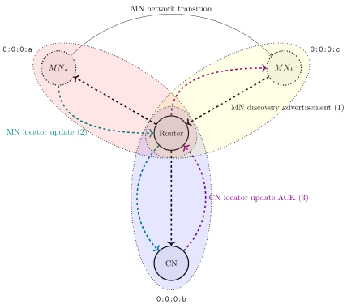
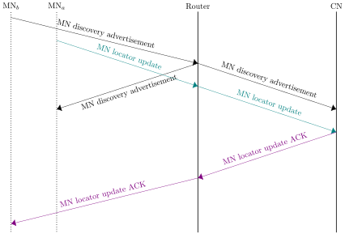
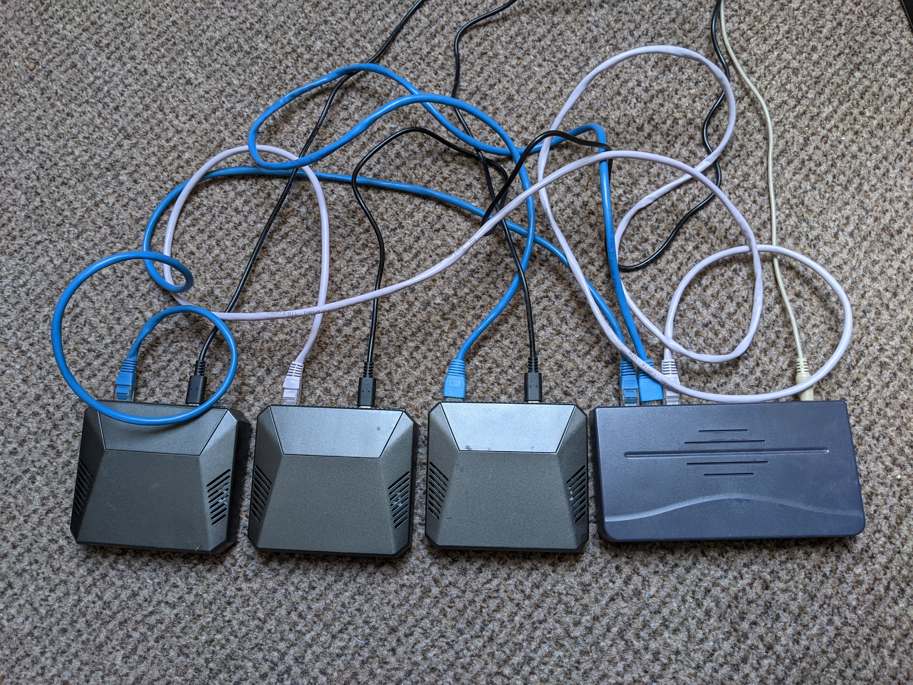
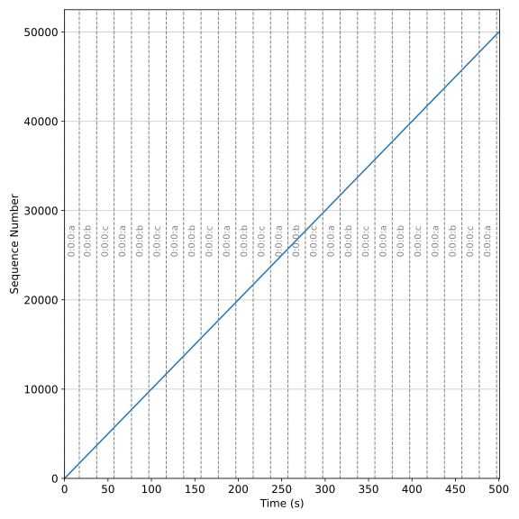
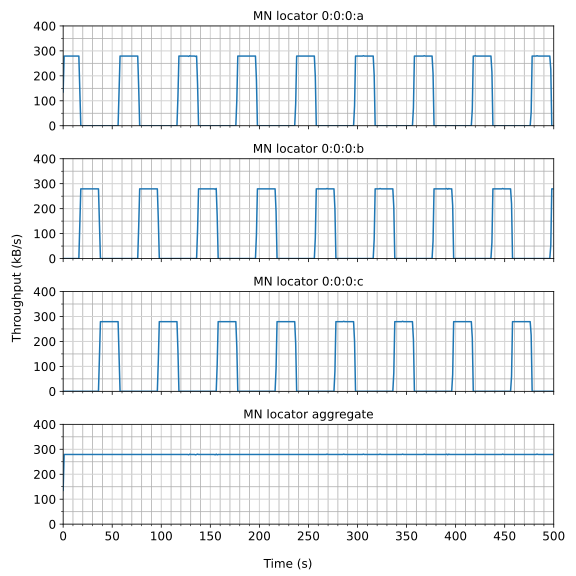
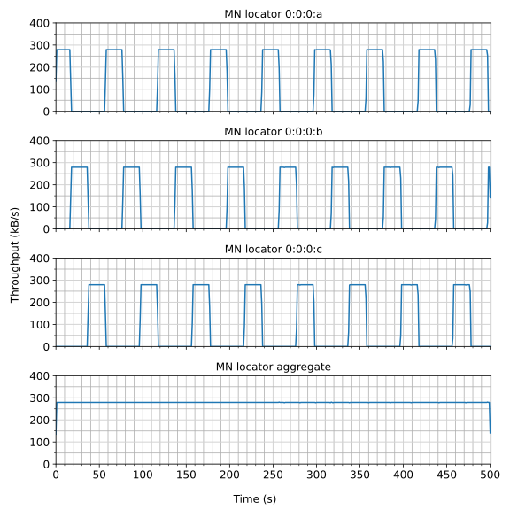
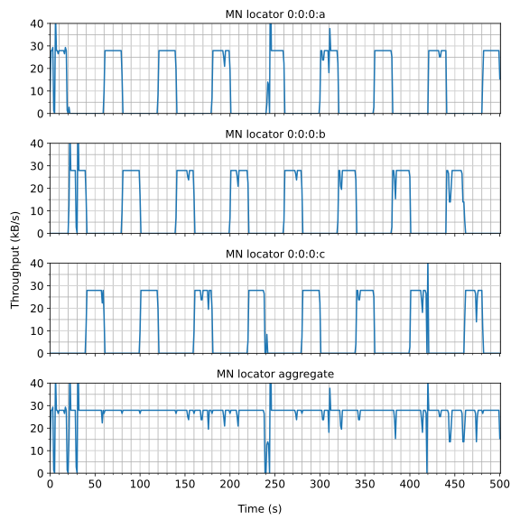

# Network Layer Mobility

2021-05-10

This project blog post is adapted from my dissertation, titled "Ubiquitous Communication for the Internet of Things: An Identifier-Locator addressing split overlay network".

A copy can be found [here](/resources/diss.pdf) (or [here](https://studres.cs.st-andrews.ac.uk/Library/ProjectLibrary/cs4099/2021/rtg2-Final_Report.pdf) for St Andrews folk), and the associated implementation can be found at [github.com/RyanGibb/ilnp-overlay-network](https://github.com/RyanGibb/ilnp-overlay-network).

## Network stack

First, some prerequisite networking knowledge.
A network protocol stack is a view of how protocols are organised into layers.
The [OSI model](https://en.wikipedia.org/wiki/OSI_model) describes named layers; including the physical, link, network, transport, and application layers.
Note the OSI model and TCP/IP have [differing semantics](https://en.wikipedia.org/wiki/Internet_protocol_suite#Layer_names_and_number_of_layers_in_the_literature"), but this is beyond the scope of this blog post.
The modularity of protocols in a network stack has many advantages, such as allowing the protocol used at a layer to be exchanged transparently.

The protocol stack we're concerned with is based off the [Internet Protocol suite](https://en.wikipedia.org/wiki/Internet_protocol_suite), also known as TCP/IP.

This network stack is often referred to as an hourglass, with the Internet Protocol (IP) as the skinny waist.

](images/diagrams/hourglass_cropped.svg){width=50%}

Packets of a protocol are encapsulated by the protocol below, for example:

](images/diagrams/UDP_encapsulation.svg)

## Motivation

Ubiquitous Computing is a vision of the future of computing where devices are omnipresent and exist in many forms.
The Internet of Things (IoT) is a modern interpretation of this which envisions many objects existing as Internet-connected smart devices; such as wearable devices, smart vehicles, and smart appliances like fridges, washing machines, and ovens.
Many of these devices are physically mobile, which requires network support when moving location.

When we say network mobility in this blog, what we are in fact referring to is network layer (layer 3) mobility.
This is also known as a vertical handoff, where the underlying link layer technology can change, like moving from a WiFi to a cellular network.
This is to distinguish it from link layer (layer 2) mobility - horizontal handoffs - where the link layer technology and layer 3 network remain the same but the network access point changes, such as when moving between cells in a mobile cellular network.
Layer 2 mobility is insufficient when a mobile device moves between link layer technologies or layer 3 networks.

Some examples of mobile IoT devices would be health monitoring devices and smart vehicles.
These devices may require constant connectivity with a fast-changing large number of network connectivity options available, particularly in urban environments.
For example, a health monitoring device switching from a cellar network to a WiFi network when entering an office building where no cellular signal is available.

The largest solution space for this at the moment is implementing mobility through IoT middleware applications.
Middleware, sitting in the application layer, provides a platform for common functionality, including mobility.
It is comparatively very easy to deploy such a solution compared to reworking the networking stack.
However, it requires the application software to be written for and tied to a specific middleware API, which is rarely standardised.
It also adds an additional layer to the node's network stack, with performance and energy use implications, which are particularly relevant to resource-constrained IoT devices.

Ideally, what we want is network support for mobility transparent to the application layer.
If we were able to implement mobility at the network layer it would solve our problems!

## Mobility in IP

As we've discussed, IP is the skinny waist of the Internet.
It ties all the other protocols together allowing nodes (computers in a network) to communicate over interoperating networks with potentially different underlying technologies.

IP was designed in 1981.
In the same year, IBM introduced its Personal Computer (PC) weighing over 9kg.
Today, many mobile computers exist in the form of personal smartphones, in addition to the IoT devices already discussed.
IP was not designed for such mobile devices and does not support mobility.

There are two issues with IP pertaining to mobility.

The first is the _overloading_ of IP address semantics.
IP addresses are used to identify a node's location in the Internet with routing prefixes and to uniquely identify a node in some scope.
This becomes an issue for mobility when a node changes its location in the network as it also has to change its IP address.

This wouldn't be an issue in and of itself if a transport (layer 4) flow could dynamically adjust to a new IP address, which brings us to the second issue with IP addresses: the _entanglement_ of layers.
All layers of the TCP/IP stack use IP addresses, and IP addresses are semi-permanently bound to an interface.

These issues together mean that when moving network all existing communication flows have to be reestablished.
This results in application-specific logic being required to deal with network transitions.
This has performance and energy use implications due to dropped packets when switching networks and having to reestablish communication sessions.
For example, TCP's 3-way handshake has to be re-done, and cryptographic protocols like TLS have to redo their key exchange.
The more resource-constrained a device, such as IoT devices, and the more continuous connectivity is required, the more important these considerations become.

## ILNP

As IP was not designed with mobility in mind most solutions to try retrofit mobility to IP somehow, such as the middleware platforms already discussed.
This is symptomatic of a larger problem: the ossification of the Internet.
It's easier to build up (in the protocol stack) than to redesign it, especially when the protocol stack is as omnipresent and critical as the modern Internet.
A radical change in IP's addressing from the Identifier-Locator Network Protocol (ILNP) architecture provides a solution to this mobility problem by separating the semantics of IP addresses into their constituent parts: an identifier and a locator.
An identifier uniquely identifies the node - within some scope - and the locator identifies the network in which the node resides, giving the node's location in the Internet.
See [RFC6740](https://tools.ietf.org/html/rfc6740) for more detail.

The overloading of IP address is solved with this Identifier-Locator addressing split.
This also allows us to solve the entanglement of layers:

](images/diagrams/ilnp_ipv6_names_cropped.svg){width=75%}

Applications that use DNS to obtain IP addresses (conforming to [RFC1958](https://tools.ietf.org/html/rfc1958#section-4)) will be backwards compatible with ILNPv6 with modifications to DNS  [RFC6742](https://tools.ietf.org/html/rfc6742)).
	
ILNP can be implemented as an extension to IPv6, called ILNPv6.
ILNP can also be implemented as an extension to IPv4 as ILNPv4, but this is not as elegant as ILNPv6 and will not be considered here.
The upper 64 bits of an IPv6 address is already used as a routing prefix and is taken as the locator in ILNPv6.
The lower 64 bits, the interface identifier in IPv6, is taken as the identifier.
ILNPv6's Identifier-Locator Vector (I-LV) corresponds to the IPv6 address.
The syntax is identical but the semantics differ.
That is, IPv6 addresses and ILNPv6 I-LVs look the same on the wire but are interpreted differently.

](images/diagrams/ilnp_ipv6_addresses_cropped.svg)

So given an IPv6 address "2001:db8:1:2:3:4:5:6", the ILNPv6 locator would be "2001:db8:1:2" and the identifier "3:4:5:6".

ILNPv6 supports mobility through dynamic binding of identifiers to locators, and ICMP locator update messages.
The locator of a node can change while retaining its identifier and communication flows.
Additionally, ILNPv6 supports seamless connectivity during a network transition with a soft handoff - making the new connection before breaking the old connection.
Note that this does require hardware support for multiple connections on the same adaptor, such as through CDMA, or two physical network adapters.

[RFC6115](https://tools.ietf.org/html/rfc6115) contains a survey of other solutions available.
Unlike alternatives ILNPv6 requires updates to the end hosts only, and does require a proxy or agent, tunnelling, address mapping, or application modifications.
The disadvantage of this approach is that it requires a reworking of the whole network stack, which makes it more difficult to deploy.

ILNP also supports other functionality of benefit to IoT devices, such as multihoming and locator rewriting relays (LRRs).
Multihoming refers to connecting a node to more than one network which enables a device to exploit any connectivity available.
This is supported by ILNP through allowing transport flows to use multiple locators simultaneously via a dynamic binding of identifiers to locators.
LLRs are middleboxes that rewrite locators for privacy and security benefits similar to those provided by NAT without breaking the end-to-end principle.

## Overlay network

An overlay network is a 'virtual' network built on another network.
Think [tor](https://www.torproject.org/).
An underlay network is the underlying network beneath an overlay network.

To demonstrate the operation of the protocol and its support for mobility an ILNPv6 overlay network was created on top of UDP/IPv6 Multicast.
An IPv6 multicast group corresponds to a locator in our overlay network, or a 'virtual network'.
There is a mechanical translation between 32-bit locators and 64-bit IPv6 multicast groups.

This overlay network was implemented in user space with Python due to time constraints of the project and difficulties associated with kernel programming.

A simple transport protocol (STP) was created for demultiplexing received ILNPv6 packets by wrapping them with a port, similar to UDP.

Note that in our overlay network, for a node, an interface simply refers to a locator which the node is connected to, via configuration files. The node will have connected to the corresponding IP multicast address.

## Discovery protocol

A discovery protocol was required for nodes to discover each other and to discover routing paths.
It is inspired by the Pv6 Neighbour Discovery Protocol.
Nodes send solicitations (requests for advertisements) and advertisements (responses to solicitations).
Both solicitations and advertisements contain a node's hostname, set of valid locators, and identifier.
This means that hostname resolution is included in our protocol, which was done to avoid the complications of a DNS deployment in our overlay.

A simple flood and backwards learn approach was taken.
When a node receives a discovery protocol message on an interface it forwards it to every other interface.
This relies on the ILNPv6 hop count being decremented to avoid infinitely looping packages in circular topologies.
Nodes eavesdrop on discovery protocol messages so one solicitation is sufficient for all nodes in a network to learn about all the others.

Discovery protocol messages are sent to a special ILNPv6 all nodes locator - essentially local broadcast in a virtual network.
Forwarding happens at the discovery protocol layer, not the ILNPv6 layer.

Backwards learning is done on these discovery protocol messages; when an ILNPv6 packet is received the forwarding table is updated mapping the source locator of the packet to the interface it was received on.
This means the discovery protocol serves to bootstrap the network by populating the forwarding table.

This protocol scales poorly - the number of messages scales quadratically with every additional network containing a node - but it is sufficient for our purposes.

See an example operation of the protocol below. Node A is in network 1, node B in network 2, and node C in both networks.

{width=75%}

{width=75%}

## Locator updates

Our overlay network supports mobility with locator update messages as part of the ILNPv6 layer.
The mobile node (MN) sends a locator update over its old locator, and the corresponding node (CN) responds with an acknowledgement via the new locator - verifying a path exists between the new locator and CN exists.

The discovery message sent by the MN on the new locator is simply for path discovery as the CN will not know how to route to 0:0:0:c with no node sending discovery messages from that locator.
An alternative solution to this would have been to make nodes send packets to all connected interfaces if there is no mapping in the forwarding table.

See an example of a MN moving from locator 0:0:0:a to locator 0:0:0:c, in a communication session with a CN in locator 0:0:0:b, below:

{width=75%}

{width=75%}

## Experiments

To demonstrate the operation of the overlay network on resource-constrained IoT devices a Raspberry Pi testbed communicating via ethernet was used. Previous work in this area has been confined to workstation or server machines.

{width=75%}

The virtual network topology was 3 networks that the MN moved between every 20 seconds, one of which the CN resided in.

{width=75%}

The experimental application sent an MTU packet with a sequence number every 10ms from the MN to CN, and CN to MN, resulting in a throughput of 266.6kB/s.

Looking at the received sequence by the CN  we can see that there's no loss or misordering - just a smooth seamless line with a constant gradient. The dotted vertical lines show the network transitions.

|
:-:|:-:
| 
Received sequence numbers vs time on CN | Received sequence numbers vs time on MN

Looking at the throughputs we can see discrete rectangles for each individual locator showing the separation between locator uses. The smooth aggregate throughput shows that, as suggested by the sequence number graphs, there is seamless connectivity between network transitions. Note that the locators listed refer to the locator the MN is connected to, even for the throughputs on the CN.

|
:-:|:-:
| 
Throughput in 1s buckets vs Time on CN | Throughput in 1s buckets vs Time on MN

## System stability issues

An interesting hardware problem was encountered when performing experiments with the overlay network on the Raspberry Pi testbed that caused system stability issues.

Taking experiment 3 as an example, the received sequence numbers were mostly linear, but there were horizontal gaps and sometimes subsequent spikes (likely due to buffering on one of the nodes):

|
:-:|:-:
| 
Received sequence numbers vs time on CN | Received sequence numbers vs time on MN

There was no loss, however.

This issue could be seen a lot more clearly in the throughput graphs:

|
:-:|:-:
| 
Throughput in 1s buckets vs Time on CN | Throughput in 1s buckets vs Time on MN

There are drops in throughput, corresponding to horizontal gaps in the graph, and sometimes subsequent spikes, corresponding to the spikes in received sequence numbers.

As the main focus of this project is obviously networking that was the first area assumed to be where the problem lay, as a scheduling or buffering issue.
But the UDP send was not blocking, and the threading and thread synchronisation were working perfectly.
The process was tried pinned to a specific CPU core with `$ taskset 0x1 <program>` to no avail.
Using `tcpdump` showed the same gaps in packets sent and received on the CN, router, and MN.

Running `top` on the Pi while running showed that when systems issues occurred (printed as a warning by the experiment program) the process was in a 'D' state.
This means it was in an uninterruptible sleep, due to I/O, otherwise data corruption could occur.
As network issues were already ruled out, the only other I/O was logging.
A long D state seems to be a common issue in Network File Systems (NFS), but that is not used here.
A system request to display the list of blocked (D state) tasks with `echo w > /proc/sysrq-trigger` was made when the process was running.
The relevant section of the kernel log from this is:

	$ dmesg
	...
	[6367695.195711] sysrq: Show Blocked State
	[6367695.199742]   task                        PC stack   pid father
	[6367695.199791] jbd2/mmcblk0p2- D    0   824      2 0x00000028
	[6367695.199801] Call trace:
	[6367695.199818]  __switch_to+0x108/0x1c0
	[6367695.199828]  __schedule+0x328/0x828
	[6367695.199835]  schedule+0x4c/0xe8
	[6367695.199843]  io_schedule+0x24/0x90
	[6367695.199850]  bit_wait_io+0x20/0x60
	[6367695.199857]  __wait_on_bit+0x80/0xf0
	[6367695.199864]  out_of_line_wait_on_bit+0xa8/0xd8
	[6367695.199872]  __wait_on_buffer+0x40/0x50
	[6367695.199881]  jbd2_journal_commit_transaction+0xdf0/0x19f0
	[6367695.199889]  kjournald2+0xc4/0x268
	[6367695.199897]  kthread+0x150/0x170
	[6367695.199904]  ret_from_fork+0x10/0x18
	[6367695.199957] kworker/1:1     D    0 378944      2 0x00000028
	[6367695.199984] Workqueue: events dbs_work_handler
	[6367695.199990] Call trace:
	[6367695.199998]  __switch_to+0x108/0x1c0
	[6367695.200004]  __schedule+0x328/0x828
	[6367695.200011]  schedule+0x4c/0xe8
	[6367695.200019]  schedule_timeout+0x15c/0x368
	[6367695.200026]  wait_for_completion_timeout+0xa0/0x120
	[6367695.200034]  mbox_send_message+0xa8/0x120
	[6367695.200042]  rpi_firmware_transaction+0x6c/0x110
	[6367695.200048]  rpi_firmware_property_list+0xbc/0x178
	[6367695.200055]  rpi_firmware_property+0x78/0x110
	[6367695.200063]  raspberrypi_fw_set_rate+0x5c/0xd8
	[6367695.200070]  clk_change_rate+0xdc/0x500
	[6367695.200077]  clk_core_set_rate_nolock+0x1cc/0x1f0
	[6367695.200084]  clk_set_rate+0x3c/0xc0
	[6367695.200090]  dev_pm_opp_set_rate+0x3d4/0x520
	[6367695.200096]  set_target+0x4c/0x90
	[6367695.200103]  __cpufreq_driver_target+0x2c8/0x678
	[6367695.200110]  od_dbs_update+0xc4/0x1a0
	[6367695.200116]  dbs_work_handler+0x48/0x80
	[6367695.200123]  process_one_work+0x1c4/0x460
	[6367695.200129]  worker_thread+0x54/0x428
	[6367695.200136]  kthread+0x150/0x170
	[6367695.200142]  ret_from_fork+0x10/0x1
	[6367695.200155] python3         D    0 379325 379321 0x00000000
	[6367695.200163] Call trace:
	[6367695.200170]  __switch_to+0x108/0x1c0
	[6367695.200177]  __schedule+0x328/0x828
	[6367695.200184]  schedule+0x4c/0xe8
	[6367695.200190]  io_schedule+0x24/0x90
	[6367695.200197]  bit_wait_io+0x20/0x60
	[6367695.200204]  __wait_on_bit+0x80/0xf0
	[6367695.200210]  out_of_line_wait_on_bit+0xa8/0xd8
	[6367695.200217]  do_get_write_access+0x438/0x5e8
	[6367695.200224]  jbd2_journal_get_write_access+0x6c/0xc0
	[6367695.200233]  __ext4_journal_get_write_access+0x40/0xa8
	[6367695.200241]  ext4_reserve_inode_write+0xa8/0xf8
	[6367695.200248]  ext4_mark_inode_dirty+0x68/0x248
	[6367695.200255]  ext4_dirty_inode+0x54/0x78
	[6367695.200262]  __mark_inode_dirty+0x268/0x4a8
	[6367695.200269]  generic_update_time+0xb0/0xf8
	[6367695.200275]  file_update_time+0xf8/0x138
	[6367695.200284]  __generic_file_write_iter+0x94/0x1e8
	[6367695.200290]  ext4_file_write_iter+0xb4/0x338
	[6367695.200298]  new_sync_write+0x104/0x1b0
	[6367695.200305]  __vfs_write+0x78/0x90
	[6367695.200312]  vfs_write+0xe8/0x1c8
	[6367695.200318]  ksys_write+0x7c/0x108
	[6367695.200324]  __arm64_sys_write+0x28/0x38
	[6367695.200330]  el0_svc_common.constprop.0+0x84/0x218
	[6367695.200336]  el0_svc_handler+0x38/0xa0
	[6367695.200342]  el0_svc+0x10/0x2d4

Looking at the `python3` task stacktrace:

- `jbd2` is the thread that updates the filesystem journal, and `ext4` is the default Ubuntu file system (as well as a lot of other distributions)
- We can see than an inode is marked as dirty with `ext4_mark_inode_dirty`, and a file written with `ext4_file_write_iter`, and then a virtual file system write `vfs_write` is translated into an ARM write `__arm64_sys_write`.

	So this is happening during a file write.
- In ARM, `svc` means supervisor call, and `el0` exception level 0 (the lowest level of exception), so some sort of exception occurs and is then handled with `el0_svc_handler`.

Running `trace -r -t -v -p <PID of process>`, we can see the writes that take an exceptionally long amount of time. Here is an example where the write of 288 bytes to file descriptor 5 executes successfully but takes 2.24 seconds to complete:

	21:47:28.684124 (+ 0.000226) write(7, "2021-04-10 21:47:28.684061 [0:0:"..., 194) = 194
	21:47:28.684381 (+ 0.000256) write(1, "2021-04-10 21:47:28.684308 [alic"..., 122) = 122
	21:47:28.684583 (+ 0.000202) write(1, "\n", 1) = 1
	21:47:28.684786 (+ 0.000202) pselect6(0, NULL, NULL, NULL, {tv_sec=0, tv_nsec=5647000}, NULL) = 0 (Timeout)
	21:47:28.690796 (+ 0.006023) pselect6(0, NULL, NULL, NULL, {tv_sec=0, tv_nsec=0}, NULL) = 0 (Timeout)
	21:47:30.930965 (+ 2.240200) write(5, "2021-04-10 21:47:30.930813 0:0:0"..., 228) = 228
	21:47:30.931427 (+ 0.000433) getuid() = 1000
	21:47:30.931812 (+ 0.000385) socket(AF_UNIX, SOCK_DGRAM|SOCK_CLOEXEC, 0) = 9
	21:47:30.932142 (+ 0.000328) ioctl(9, SIOCGIFINDEX, {ifr_name="eth0", }) = 0
	21:47:30.932506 (+ 0.000364) close(9) = 0
	21:47:30.933208 (+ 0.000705) write(4, "2021-04-10 21:47:30.933090 [ff12"..., 348) = 348

So the problem seems to be exceptions that sometimes occur during file writes, which take a long time to resolve.
These block the process executing by putting it in a D state until the write returns, affecting the system stability.
These exceptions being the cause would make sense, as these issues aren't occurring consistently, but rather intermittently.
This is happening on the MN, on the router, and on the CN; so its effect is being amplified 3 times.
These exceptions are likely due to the page cache being flushed to disk, combined with poor performance of the Pi's SD cards.
But finding the root cause would require more investigation.
Regardless, enough is now known to fix the problem.

Removing the logging improved the system stability, but the issues still occurred with reduced frequency. This is because the experimental log is written to `stdout`, and `stdout` is piped to disk.

The program was being ran on the Pi's through SSH piping `stdout` to a file, like this:

	$ ssh HOST "RUN > EXPERIMENT_LOG_FILE"

Changing this to:

	$ ssh HOST "RUN | cat > EXPERIMENT_LOG_FILE"

Fixed the issue once and for all.

This essentially spawns another process to write to the file, and lets the shell buffer between them. When an I/O exception occurs the writing process is put in a D state until the exception is handled, but the Python process is unaffected as its output is buffered until the writing process is able to read from it again.

## Conclusion

This project has involved creating an ILNP overlay network, focusing on protocol design and operation; performing an experimental analysis with resource-constrained IoT devices; and demonstrating the protocol's support for mobility with seamless network transitions through the use of a soft handoff.

The limitations of this project are the performance of the program due to the overlay and use of Python; the scaling of the discovery protocol; only one application program is supported for a virtual network stack as it runs on a single process without IPC; and only one instance of the program can be run on a machine, due to the multicast UDP socket used by each instance of the program being bound to the same port.

Further work in this area includes:

-  experimenting with a kernel implementation of ILNPv6 on IoT devices 
-  investigating a multihoming policy and the benefits gained from the multipath effect for IoT devices 
-  performing experiments of IoT devices transitioning between networks using a wireless communication link layer such as IEEE 802.11/WiFi, as this more appropriate than Ethernet for an IoT context 
-  performing experiments with two mobile nodes communicating
-  performing experiments with even more resource-constrained devices than Raspberry Pis, such as wireless sensors nodes 

As mentioned at the start, see the [dissertation](../../resources/diss.pdf) on which this blog was based for a bit more nuance, and a lot more detail.

If you spot any errors or have any questions feel free to get in touch at [ryan@gibb.xyz](mailto:ryan@gibb.xyz).
