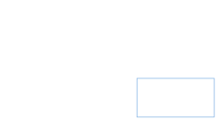

# Nim
I recently had the good fortune to attended a talk by Simon Peyton Jones titled "Immutability changes everything: 40 years of functional programming" which chronologic Simon's life and research career.
Simon is a self-described one trick pony, where that trick is functional programming.
However, this trick has taken him from being a major instigator in Haskell - he remains a lead developer of the Glasgow Haskell Compiler to this day - to Microsoft research, and more recently to Epic Games working on a new programming language dubbed '[Verse](https://discourse.haskell.org/t/an-epic-future-for-spj/3573)'.
In this talk Simon described how he first got interested in Computer Science through a problem posed to him: the game Nim.

![[^0]](dalle2.png){width=50% min-width=5cm}

[^0]: Generated by [DALL.E 2](https://openai.com/dall-e-2/).

### The game
Picture the scene: you and your opponent stare each other down across stacks of gold doubloons.
You place a wager, you'll each take turns taking 1 or more coins from a single pile, and whoever takes the last coin wins.

Let's think through your strategy...

To start with a very simple scenario consider two stacks; one with 2 coins, and one with 3 coins.

{width=30%}

If you take all of one pile:

{width=30%}

Then your opponent can take all off the other, leaving you penniless:

{width=30%}

Let's rethink...

Instead, if you take one from the pile of three to make the piles equal:

{width=30%}

Then if your opponent takes all of either pile, you can just take the remaining pile.
But let's imagine they are slightly more canny and they only take one from a pile:

{width=30%}

It seemed to have worked last time, so let's repeat our trick of making the piles equal:

{width=30%}

Your opponent will be forced to take one coin:

{width=30%}

And then fortunes are yours!

{width=30%}

### A strategy

Nim is a solved game for an arbitrary number of stacks.
We can use a a _binary digital sum_, denoted the ''nim-sum' to come up with an optimal strategy.
That is, a sum -- ignoring carrying -- of the binary values for every stack size.
Another word for this operation is 'exclusve or' (⊕).
For stacks A size 5, B size 2, and C size 3, this is equal to A⊕B⊕C:

<pre>
A⊕B⊕C
=5<sub>10</sub>⊕2<sub>10</sub>⊕3<sub>10</sub>
=101<sub>2</sub>⊕010<sub>2</sub>⊕011<sub>2</sub>
=111<sub>2</sub>⊕011<sub>2</sub>
=100<sub>2</sub>
=4<sub>10</sub>
</pre>

Where subscript numbers denote base.

The key to Nim is to always finish your turn with a num-sum of 0.
This is always possible as long as the nim-sum isn't 0 at the start of your turn.
The nim-sum will always be less than the value of the largest stack, so you can take the decimal value of the nim-sum from this (or another) stack - which will result in a nim-sum of zero.
If the nim-sum is already zero, taking any coin will make that no longer the case.

The player who can win the game will be the player with a zero nim-sum on their last turn, which is predicated on them having a zero nim-sum (and their opponent always having a non-zero nim-sum) on their turn from the beginning.
You will note, that this makes the outcome of the game entirely deterministic on the initially state of the board and whoever has the first turn.

A formal verison of this hand-waving inductive proof can be found [here](https://en.wikipedia.org/wiki/Nim#Proof_of_the_winning_formula).

### Some reflections
This talk was not my first encounter with Nim.
In fact, as my S6[^1] advanced higher computing project I implemented this game.

[^1]: S6 meaning senior phase 6, as I just found out.

As part of this I implemented a crude AI opponent which played optimally using the nim-sum with some probability based on a difficulty:
```C#
private void AITurn() {
    int nim_sum = 0x0;
    int[] Stacks_binary_values = new int[number_of_stacks];
    for (int i = 0; i < number_of_stacks; i++) {
        Stacks_binary_values[i] = Convert.ToByte(Stacks[i].Text);
        nim_sum = nim_sum ^ Stacks_binary_values[i];stacks binary values
    }
    if (nim_sum == 0x0 || random.NextDouble() > AIdifficulty) {
        int stack_index = random.Next(number_of_stacks);
        Stacks[stack_index].Text = random.Next(int.Parse(Stacks[stack_index].Text)-1).ToString();
        if (Stacks[stack_index].Text == "0") {
            Stacks[stack_index].Hide();
            Disks[stack_index].Hide();
        }
        current_stack = stack_index + 1;
    } else {
        for (int i = 0; i < number_of_stacks; i++) {
            if ((nim_sum ^ Stacks_binary_values[i]) < Stacks_binary_values[i]) {
                Stacks_binary_values[i] = nim_sum ^ Stacks_binary_values[i];
                Stacks[i].Text = Convert.ToString(Stacks_binary_values[i]);
                if (Stacks[i].Text == "0") {
                    Stacks[i].Hide();
                    Disks[i].Hide();
                }
                current_stack = i + 1;
                break;
            }
        }
    }
    TurnTaken();
}
```

At the time I only really knew how to program in Visual Studio, and wanting to move away from visual basic C# was the natural choice.
I believe they even use the same intermediate representation.

The source code and binary (but build instructions are left as an exercise for the reader) of this game can be found [here](https://github.com/RyanGibb/nim).

Reflecting on this project, while it had some inane requirements - like writing out the entire program in pseuocode beforehand and using a strict waterful methodology, all of which was done retrospectivly of course - it really got me to consider studying computer science further, which led me to where I am today.

