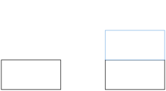

# Nim


I recently had the good fortune to attended a talk by Simon Peyton Jones titled "Immutability changes everything: 40 years of functional programming" chronologing Simon's career researching lazy functional programming languages.
At the University of Glasgow he was a major contributor to haskell, and remains a lead developer of the Glasgow Haskell Compiler to this day.
He's recently moved from Microsoft Research Cambridge to work at Epic Games on a new programming language dubbed '[Verse](https://discourse.haskell.org/t/an-epic-future-for-spj/3573)'.
In this talk Simon described how he originally became interested in Computer Science: through a game called Nim.

![[^1]](dalle2.png){width=50%}

[^1]: Generated by [DALL.E 2](https://openai.com/dall-e-2/)

### Playing the game

You and your oponent face a number of stacks of coins on a table.
On your turn, you can take any number greater than 1 coins from exactly one stack. Whoever takes the last coin wins (playing a _normal_, as oppsed to _misère game_, game).

Let's take a very simple example with two coins in one pile, and three in the other.

{width=30%}

If you take all of one pile:

{width=30%}

Then your opponent can take all but one from the other, leaving you to lose:

{width=30%}

Let's rethink...

Instead, if you take one from the pile of three to make the piles equal:

{width=30%}

If your opponent takes all of one pile, fortunes are yours! You can just take all of the remaining pile.
But let's imagine they're a little more canny and they only take one from a pile:

{width=30%}

It seemed to have worked last time, so let's repeat our trick of making the piles equal:

{width=30%}

Your opponent will be forced to take one coin:

{width=30%}

And then fortunes are yours!

{width=30%}

You will be left with two piles, from which you'll be forced to take one.

Your opponent will take the last and win the game again.

However, if you take two from the pile initially, the roles will be revered for this exact scenario and fortunes are yours!

### A recipe for success

Nim is a solved game for an arbitrary number of stacks with a _binary digital sum_.
That is, a sum -- ignoring carrying -- of the binary values for every stack size.
Another word for this operation is exclusve or (⊕).
For stacks A size 5, B size 2, and C size 3, this is equal to A⊕B⊕C:

<pre>
A⊕B⊕C
= 5<sub>10</sub>⊕2<sub>10</sub>⊕3<sub>10</sub>
= 1012<sub>2</sub>⊕0102<sub>2</sub>⊕0112<sub>2</sub>
=1112<sub>2</sub>⊕0112<sub>2</sub>
=1002<sub>2</sub>
=4<sub>10</sub>
</pre>

The key to nim is to always finish your turn with a num sum of 0, which is always possible if the nim-sum is not zero before the start of your turn.

### Reflections on history

As part of my S6 (Senior phase 6, ~17) Advanced Higher Computing Project I decided to implement the game Nim.
This meant 


https://github.com/RyanGibb/nim


Here is some code calculting the nim-sun for the AI's turn:
```
private void AITurn() {
    int nim_sum = 0x0;
    int[] Stacks_binary_values = new int[number_of_stacks];
    for (int i = 0; i < number_of_stacks; i++) {
        Stacks_binary_values[i] = Convert.ToByte(Stacks[i].Text);
        nim_sum = nim_sum ^ Stacks_binary_values[i];stacks binary values
    }
    if (nim_sum == 0x0 || random.NextDouble() > AIdifficulty) {
        int stack_index = random.Next(number_of_stacks);
        Stacks[stack_index].Text = random.Next(int.Parse(Stacks[stack_index].Text)-1).ToString();
        if (Stacks[stack_index].Text == "0") {
            Stacks[stack_index].Hide();
            Disks[stack_index].Hide();
        }
        current_stack = stack_index + 1;
    } else {
        for (int i = 0; i < number_of_stacks; i++) {
            if ((nim_sum ^ Stacks_binary_values[i]) < Stacks_binary_values[i]) {
                Stacks_binary_values[i] = nim_sum ^ Stacks_binary_values[i];
                Stacks[i].Text = Convert.ToString(Stacks_binary_values[i]);
                if (Stacks[i].Text == "0") {
                    Stacks[i].Hide();
                    Disks[i].Hide();
                }
                current_stack = i + 1;
                break;
            }
        }
    }
    TurnTaken();
}
```


Nim - Honestly don't remember where I found this game, but I thought it was interesting.

And once you know the trick, building a perfect AI opponent is trivial.

Haven't thought about this in years, apart from adding a repo and trying and failure to compile it (an interesting exercise in reproducibility)

Inane requirements - like writing out the entire program in pseuocode beforehand and using a strict waterful methodology


I had been taught Vb, had friend's learning Python & JAva, but I really only knew how to code in the Visual Studio IDE.
I had enough foresight to want to move away from Visual Basic, and C# was a natural choice due to IDE support and feature parity (same IR) https://en.wikipedia.org/wiki/Comparison_of_C_Sharp_and_Visual_Basic_.NET

This started my prefered way of learning programming languages: just start building something and figure things out from there.
Normally this means getting stuck and consulting stack overflow or preferable the documentation.
I view programming as kind of like riding a bike - it's all well and good to read a textbook on how to do it but to do it in reality you need to practive


needless to say some of these were completed


### Wrapping up

Computing Education


